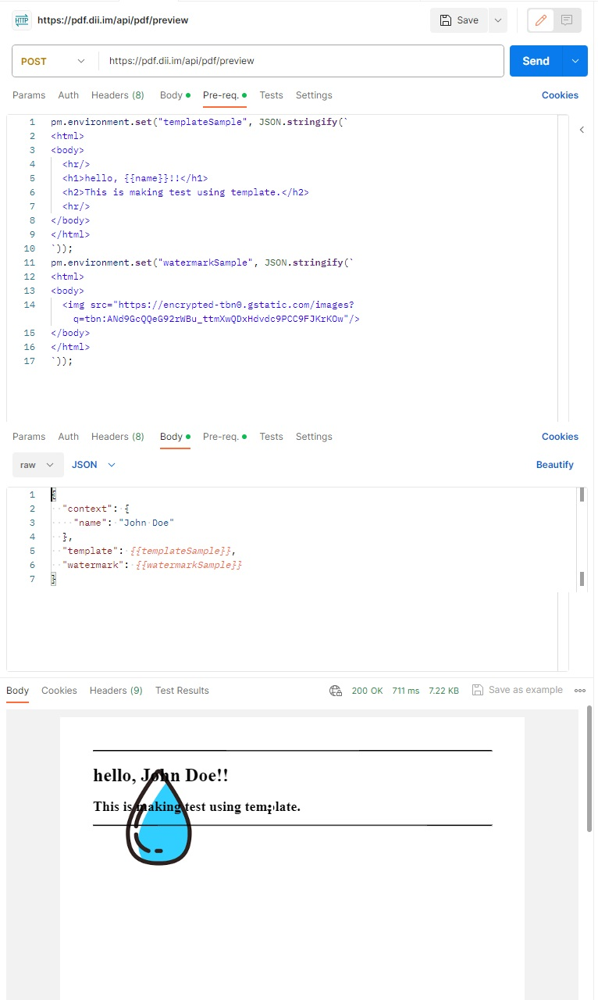

# PdfMaker : A SpringBoot Demo Application

Ths application is the backend api part of a generator that creates pdf from html code. It is intended to aid the demonstration and testing of the related technologies.

It is built using [Spring Boot](http://projects.spring.io/spring-boot/), [Mustache](https://github.com/samskivert/jmustache/), [Apache PDFBox](https://pdfbox.apache.org/) and [Flying Saucer](https://github.com/flyingsaucerproject/flyingsaucer) and is packaged in Docker containers.

## Usage

